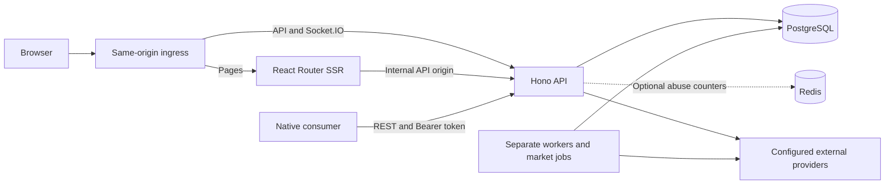

# Current architecture

Source review: 2026-09-27. This describes the implemented repository. The [original plan](../PLAN.md) retains historical design intent; [ADRs](adr/) record accepted decisions. Product and release boundaries are in [PRODUCT.md](../PRODUCT.md).

## Runtime topology

[server.ts](../apps/api/src/server.ts) validates runtime configuration and starts the API. [runtime.ts](../apps/api/src/runtime.ts) composes HTTP, authenticated Socket.IO, diary reminders, and the price-alert checker, and closes timers/transports on shutdown. [app.ts](../apps/api/src/app.ts) composes route handlers and common request policies. Business modules live under `apps/api/src/`; the original plan's proposed `modules/` and `jobs/` directories were not adopted.

The production API uses one replica with a Recreate rollout because scheduling and realtime state are process-local. PostgreSQL job locks address individual batch overlap, not general multi-replica API coordination. Optional Redis shares rate-limit counters only. See [deployment operations](../ops/k8s/README.md) before changing topology.

Web SSR fetches through the API using an internal origin; browser requests use the public same-origin API boundary. Web does not own a parallel database or authorization layer. Foreground Socket.IO events prompt consumers to refresh authoritative data through REST; they are not durable push or offline synchronization.

## Source and package boundaries

| Path | Owns | Boundary |
| --- | --- | --- |
| [apps/web/app](../apps/web/app/) | React routes, SSR, browser state, i18n, styles, Markdown, and navigation | No database or server credential imports |
| [apps/api/src](../apps/api/src/) | Authorization, business services, provider transports, realtime, and workers | Authoritative validation and ownership checks |
| [packages/contracts/src](../packages/contracts/src/) | Runtime schemas, errors, and protocol definitions | Platform-neutral wire contracts |
| [packages/api-client/src](../packages/api-client/src/) | Generated types, standard-fetch client, and native refresh coordination | Injectable fetch/base URL/token access; no DOM or database requirement |
| [packages/domain/src](../packages/domain/src/) | Financial calculations, date rules, research calculations, and portable state rules | No Web, database, or API framework dependencies |
| [packages/db/src](../packages/db/src/) | PostgreSQL connection, Drizzle schema, and migration entrypoint | Server-side only; SQL history is in [migrations](../packages/db/migrations/) |
| [proofs/native](../proofs/native/) | Isolated Expo package consumer and native session adapter proof | Independent lockfile; not a shipping mobile application |

[package.json](../package.json) and the root lockfile own the main npm workspaces. The native proof has its own dependency installation and audit. [build-api.ts](../scripts/build-api.ts) bundles workspace code into production entrypoints so runtime commands do not depend on TypeScript source resolution.

## Authentication and access

- Browser sessions use HttpOnly cookies and CSRF protection. Native sessions return a JSON token pair and use Bearer access tokens with rotating refresh tokens. Refresh-family serialization and replay handling are documented in [ADR-0002](adr/0002-native-session-family-serialization.md); browser behavior is in [ADR-0003](adr/0003-stable-browser-session.md).
- Invalid explicit Bearer credentials fail closed rather than falling back to an ambient cookie. The [auth-session module](../apps/api/src/auth-session.ts) and route policies enforce the shared boundary.
- API keys grant explicit Agent API scopes. User ownership, Admin access, and Partner sharing remain separate checks; a sharing relationship does not grant general access to private records.
- Public tools allow guest research and calculation. Private saves require an authenticated owner. Published Member article bodies require a valid user session; Draft/Archived content stays in Admin preview. See the [access matrix](tools-access-matrix.md) and [article release boundary](../ops/k8s/production/README.md#article-access-release-boundary).
- Changing a password raises the token version and deletes every refresh token, then re-issues one replacement for the browser that proved the current password; bearer and API-key callers get no replacement and must sign in again. The response reports which happened through `sessionRetained`.
- The PWA caches allowlisted static assets rather than personal API responses or navigations; a failed navigation is answered with a precached offline page that carries no account data. Protected article HTML and Router data use private/no-store policies, with session-aware invalidation in the browser.

## Data and consistency

[schema.ts](../packages/db/src/schema.ts) and versioned SQL migrations define the durable model. API contracts serialize IDs and persisted decimals as strings; calendar dates use `YYYY-MM-DD`, while event instants use UTC timestamps. Financial rules must preserve decimal precision, missing-quote states, and the applicable user timezone.

Database constraints, transactions, row locks, and revision checks protect owner-linked records, one Diary per owner/date, concurrent append/update behavior, trade-ledger integrity, and refresh sessions. Trade edits validate the resulting chronological ledger rather than only the edited row. Intentional corrections to legacy behavior are recorded in [ADR-0001](adr/0001-parity-baseline-and-contract-corrections.md) and the relevant feature ADRs.

Initialization runs migrations followed by the repeatable [static system seed](../scripts/seed-system.ts). It does not import legacy users, seed demo accounts, or fetch market history. Integrity and concurrency tests use [disposable local PostgreSQL databases](../tests/support/database.ts), controlled external-provider fixtures, and synthetic data.

## Workers and external services

The API image contains ten built entrypoints: `server`, `ai-worker`, `research-worker`, `article-translation-worker`, `mail-worker`, `research-retention`, `rotation`, `market-state`, `migrate`, and `seed-system`. Packaging a worker does not enable or schedule it. Deployment configuration and feature settings determine which processes run.

| Work | Guide |
| --- | --- |
| Market Rotation and Market State batches | [CLI guide](rotation-cli.md) and [K3s jobs](../ops/k8s/README.md) |
| Manual AI report generation | [Feature](features/ai-reports-v1.md) and [operator runbook](runbooks/ai-reports.md) |
| Admin Research Studio and retention | [Feature and worker settings](features/research-studio.md), [source policy](research-method/source-policy-review.md) |
| Article translation | [Translation guide](article-translations.md) |
| Verification and recovery email | [Account-email runbook](runbooks/account-email.md) |

Provider credentials remain server-side and stored AI/SMTP secrets are encrypted. AI Reports and Research Studio use deployment-controlled recipient allowlists; article translation profiles configure their own HTTPS endpoints with public-address checks. SMTP permits relays that resolve to public addresses; trusted private relays additionally require an exact `SMTP_ALLOWED_HOSTS` entry. Research fetches apply the documented outbound policy, DNS/IP validation, redirect controls, and deadlines. Source rights and live-provider acceptance remain distinct from successful synthetic tests.

## Resource and security controls

The [request-body wrapper](../apps/api/src/request-body-limit.ts) caps serialized bodies at 8 MiB while allowing authentication and route rate limiting to run before lazy body consumption. [Rate limiting](runbooks/rate-limiting.md) uses memory by default or configured Redis.

SEC downloads and bundles stage files on disk and stream responses under byte limits, cancellation, deadlines, and a two-slot heavy-response gate. The [2026-09-27 audit](audits/project-cleanup-2026-09-27.md) records the synthetic memory improvement and a remaining capacity limit: metadata caches bound entry counts rather than retained bytes. Local RSS measurements are not container-memory guarantees.

[Web SSR](../apps/web/app/entry.server.tsx) sets same-origin framing, MIME-sniffing protection, and a default referrer policy, preserving stricter route policies. These headers are not a comprehensive script-source CSP. Current implementation and regression evidence are linked from the audit rather than represented as a complete security certification.

## Public host and caching

The production [ingress](../ops/k8s/production/04-ingress.yaml) resolves the apex and its `www.` alias so one certificate covers both and the alias reaches a backend. The apex is the only origin that serves the app: Web SSR answers any `www.` document with a 301, because host-only cookies would otherwise split one account into two sessions and each host would self-canonicalize into duplicate index entries. [site-origin.ts](../apps/web/app/site-origin.ts) derives canonical links, locale alternates, the sitemap, and `robots.txt` from the same normalization, which also repairs the scheme: TLS terminates at the ingress, so the request this process observes is always `http`.

Article documents carry an access-aware cache policy. A published PUBLIC article and the unfiltered index are shared-cacheable with `Vary: Cookie`, since the API resolves translations from the account locale and the `diary-locale` cookie; member bodies, lock screens, searches, and failures stay `private, no-store`. The [service worker](../apps/web/public/sw.js) serves content-hashed build assets from its cache first, revalidates stable-path assets in the background, never caches a document or API response, and answers a failed navigation with a precached offline page.

## Build, verification, and release

The package minimum and source CI runtime are Node.js 22.22; the production [Dockerfile](../Dockerfile) uses Node.js 24 and the API bundle targets Node.js 24. Use Node.js 24 when checking production artifacts locally. Local Compose provides PostgreSQL and an optional Redis profile.

The [project README](../README.md#verification) lists source, integration, and sequential browser commands. Built-artifact browser tests exercise production bundles; the WebKit critical suite deliberately blocks service workers. Native exports and package-consumer checks have a separate [evidence boundary](native/app-ready-audit.md).

[CI/CD notes](operations/ci-cd-notes.md) describe blocking versus advisory gates and deployment triggers. Current local evidence does not authorize production cutover, establish multiple API replicas, clear AI/Research external release gates, or prove physical-device behavior. Keep those decisions tied to their own acceptance records.
